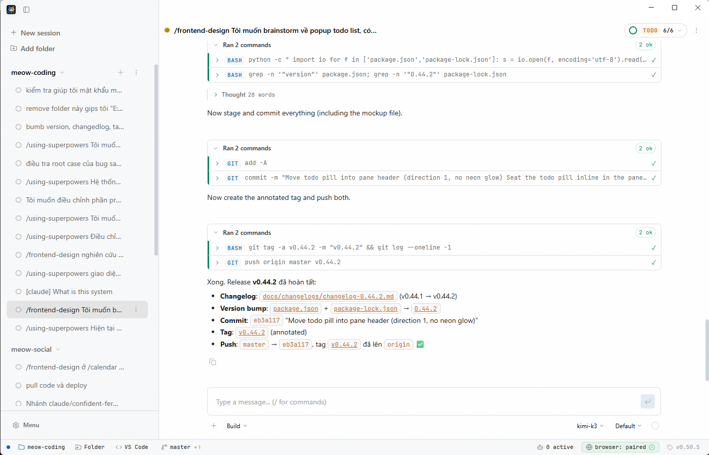
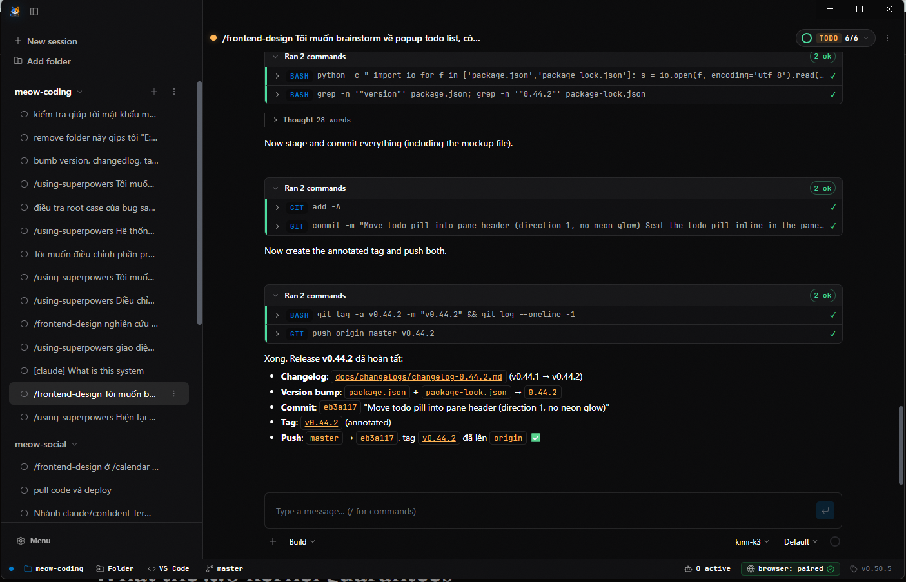

# Meow Coding

**Meow Coding** is a desktop app for running a built-in **native "Meow" agent** across multiple coding
**sessions** side by side — each session its own chat, in its own pane — inside a single window. The
agent ships with a chat UI, tool registry, sessions, permissions, and skill system.

<p align="center">
  
</p>

<p align="center">
  
</p>

## Highlights

- **Parallel sessions** — run several coding sessions in one window, each in its own pane, and switch
  between them from the sidebar. A session you are not looking at stays mounted and keeps running.
- **Native Meow agent** — a first-party coding agent with chat UI, streaming output, markdown
  rendering, tool-call cards, image attachments, and undo/redo.
- **Slash commands** — `/init`, `/review`, `/new`, `/compact`, `/frontend-design`, and Superpowers
  workflows (such as `/brainstorming`, `/writing-plans`), plus custom commands with `$1..$N`,
  `$ARGUMENTS`, `@path` references and `` !`cmd` `` shell interpolation.
- **Bundled skills** — 21 skills loadable by the agent: 15 Superpowers workflow skills, 5 Anthropic
  front-end/design skills (`frontend-design`, `canvas-design`, `theme-factory`, `brand-guidelines`,
  `web-artifacts-builder`), and `katalon-studio`.
- **Sessions** — create / switch / rename / delete conversations from the sidebar, with auto-title
  and per-session undo/redo through file snapshots.
- **Subagents & delegation** — the `task` tool spawns isolated subagents with narrowed permissions,
  and `delegate_session` hands a focused task to another persistent session in the same project.
- **Hooks & memory** — `PreToolUse` / `PostToolUse` / `Stop` hooks run your own policy outside the
  context window, and a per-project `.meow/memory/` store keeps durable notes across sessions.
- **MCP & LSP** — stdio and HTTP MCP servers, plus language-server diagnostics surfaced in the
  agent's edit tools.
- **Cost tracking** — token and dollar usage per session and per model via the models.dev catalog.
- **Office documents** — the native agent can create and edit `.docx`, `.xlsx`, and `.pptx` through
  the `office` tool (powered by OfficeCLI; binary auto-downloaded on first use).
- **Model Connections** — connect multiple Codex (ChatGPT OAuth) accounts, switch the active one,
  and keep API keys in the encrypted OS keychain (see below).
- **Files & Processes overlays** — opened from a session's `⋮` menu: an in-app explorer with a
  lazy-loaded directory tree, name filter and `?` content search, plus a per-session view of
  background shells and monitors with live streamed output.
- **Browser bridge** — control a real Chrome profile through a loopback WebSocket bridge and an
  approved Chrome extension (MV3), with browser/click/type tools for the native agent.
- **Background updates** — a new version downloads as soon as it is found and installs silently on
  quit; a notification offers an immediate restart.

## What it's based on (Sources)

Meow Coding is built on open-source technology and openly credits its design influences:

- **opencode** — the native agent's feature set (slash commands, undo/redo, LSP diagnostics,
  compaction, cost tracking, MCP, skills) is modeled on opencode's architecture. See
  `docs/superpowers/notes/2026-08-05-opencode-feature-diff.md` for the detailed feature comparison.
- **[obra/superpowers](https://github.com/obra/superpowers)** — the Superpowers workflow skills
  (brainstorming, writing-plans, executing-plans, systematic-debugging, etc.) bundled under
  `resources/skills/`.
- **[anthropics/skills](https://github.com/anthropics/skills)** (Apache-2.0) — the front-end and
  design skills (frontend-design, canvas-design, theme-factory, brand-guidelines,
  web-artifacts-builder), bundled verbatim with their original `LICENSE.txt`.
- **[iOfficeAI/OfficeCLI](https://github.com/iOfficeAI/OfficeCLI)** (Apache-2.0) — the `office` tool
  for creating and editing Office documents.
- **[CLIProxyAPI](https://github.com/router-for-me/CLIProxyAPI)** (MIT) — wrapped by the
  `meow-cliproxy` sidecar that gives each Codex account its own scoped OpenAI-compatible proxy.
- **[@lydell/node-pty](https://github.com/microsoft/node-pty)** and **[xterm.js](https://xtermjs.org/)**
  — PTY and terminal rendering (runtime parked, still shipped).
- **Electron, electron-vite, React, TypeScript** — the application shell and UI.

## Features

### Workspaces & panes

- Add git project folders as workspaces (persisted in `userData/workspaces.json`).
- Every project starts with a native **meow** session; add more with the sidebar `+`.
- Per-pane status badge shows agent state, git branch, and dirty-file count.
- Agents can run in the background.

### Native agent

- Full tool registry: `bash`, `bash_output`, `kill_shell`, `monitor`, `edit`, `write`, `read`,
  `apply-patch`, `glob`, `grep`, `git`, `question`, `todowrite`, `task` (subagents),
  `delegate_session`, `revert`, `skill`, `webfetch`, `websearch`, `lsp`, `browser` (drive a real
  Chrome profile), and `office`.
- Permission rules per tool: `allow` / `ask` / `deny`, with "always allow" persistence.
- Context compaction with auto-continue, prune, and tool-output truncation to stay within budget;
  `/compact [focus]` summarizes on demand.
- Hooks (`PreToolUse` / `PostToolUse` / `Stop` and lifecycle events) configured in `meow.json` or
  `.meow/hooks.json`; they run outside the context window and can only tighten policy.
- Per-project memory in `.meow/memory/` with a `MEMORY.md` index injected at turn start.
- User tools loaded from `userData/tools`, and project `.meow/` directories for project-level
  commands, skills, subagent roles, hooks, memory, and AGENTS.md instructions.
- System prompt assembles AGENTS.md instructions, memory, available skills, and workspace context.
- Failed turns persist as error cards with a **Retry** action when the failure is retryable.

### Providers & models

- Anthropic, Google, and any OpenAI-compatible endpoint.
- Model catalog from models.dev with provider/model browsing and per-agent model selection.
- Model variants (effort levels) and a "plan" vs "build" agent mode.

### Model Connections (account management)

- **Codex (ChatGPT OAuth)**: connect multiple Codex accounts with PKCE OAuth in the Providers
  screen, pick the active account, and chat with its models. Chat requests run through an
  account-scoped local OpenAI-compatible proxy (`meow-cliproxy`, built on the MIT-licensed
  CLIProxyAPI), so a credential issued for one account can never route through another. Your real
  `~/.codex/auth.json` is never read or written.
- **Secrets**: OAuth access/refresh/ID tokens are stored only in the encrypted OS keychain
  (safeStorage); the metadata index under `userData/connections` holds non-secret account
  information only. Runtime proxy config is removed on shutdown and stale directories are cleaned
  at the next launch.
- **API key vault**: provider API keys stored encrypted in the OS keychain (safeStorage) instead of
  plaintext in settings; `keyRef` resolves at runtime.
- Claude Code and Antigravity OAuth are not enabled in this release; the provider/account
  architecture is ready for their adapters.

### UI & desktop

- Frameless custom title bar (min / max / close) with lucide-react icons.
- Light & dark themes (VSCode Light+ / Studio Dark palettes) with a Sun/Moon toggle in the sidebar;
  popups re-theme live, and the choice persists across restarts.
- Settings dialog covering sub-agents, providers, MCP, permissions, commands, context, external
  delegation, personalize, and updates.
- Idle/exit alert notifications; per-agent logs written to `userData/logs/<agentId>.log`.
- Closing the window hides to tray so sessions keep running; a second launch focuses the existing
  window instead of starting a duplicate.

### Files overlay

- **Entry point** — a session pane's `⋮` menu → **Files**; it opens docked on the right of the pane
  area — the slot the old right panel used (never an OS window, so the title bar, sidebar and status
  bar stay visible), resizable by its left edge (320–900px, default 420px, remembered across runs).
- **Directory tree** — lazy-loads folders on first expand, lists dotfiles and `node_modules` too, and
  refreshes in the background when the project changes (`⋮` → Refresh / Collapse all).
- **Filter** — narrows the tree by name; a `?` prefix searches file contents instead and lists
  `path:line` hits.
- **Open-file tabs** — clicking a file in the tree or a search hit opens a tab beside the tree with
  its content: a CodeMirror editor with syntax highlighting, rendered markdown, or plain text, plus
  Raw/Highlighted, Copy and Open in VS Code. `⤢` expands the panel over the whole pane area and
  restore docks it again — the tree, tabs and open files survive the toggle. `Esc` / `✕` close it,
  and switching project closes it.
- **Parked right panel** — the earlier right panel (directory tree + the artifacts list of the `.md`
  files agents created or edited, with `(mtime, size)` baseline filtering of spurious watcher events)
  is no longer rendered; its components, CSS, state and the artifact store/IPC remain in the source,
  and the Files panel docks into its slot.

### Processes overlay

- **Entry point** — a session pane's `⋮` menu → **Processes**; it docks in the same slot as the Files
  overlay (resizable by its left edge, remembered across runs).
- **Background shells & monitors** — the left column lists the agent's background shells (with a
  Kill button on running ones) and active monitors; the right side streams the selected shell's
  live output.

### External delegation (Claude Code → Meow)

- **Settings → External delegation** enables a loopback API (off by default) so Claude Code can hand
  plan tasks to Meow.
- A dependency-free `meow-delegate` CLI (`start`, `send`, `status`, `cancel`) is copied to
  `userData/bin/`; each plan gets its own visible `[claude] <plan>` session.
- **Install Claude skill** writes a `meow-delegate` skill to `~/.claude/skills/` that tells Claude to
  delegate task by task, verify the diff and tests itself, and send at most 3 feedback rounds.

## Architecture

Electron runs three isolated processes communicating over a centralized IPC contract, plus a
companion Chrome extension:

- **`src/main`** — Electron main process: PTY management, stores, services, IPC handlers, and app
  lifecycle. The only place that spawns/kills processes. Also hosts the Chrome browser bridge
  (`src/main/browser`), the loopback external-delegation API (`src/main/external-api`), and the file
  watcher that attributes agent edits to artifacts.
- **`src/preload`** — context bridge exposing a typed `window.api` (implements `AgentApi`).
- **`src/renderer`** — React UI: sidebar with per-project session rows, session panes with the
  native-agent chat panel, and the in-app Files / Processes overlays (the old right-panel
  explorer/artifacts is parked in the source).
- **`src/shared`** — shared types and the IPC contract (`Channels` + `AgentApi`); no Node/Electron
  imports here.
- **`src/browser-extension`** — Chrome MV3 extension (built separately with esbuild) that connects
  to the desktop browser bridge and is approved once in the app.

(The browser extension is not an Electron process; it connects to the desktop over WebSocket.)

Security: `contextIsolation: true`, `nodeIntegration: false`; the renderer never touches Node or
Electron directly.

## Requirements

- Node.js 20+
- Git
- A provider API key (Anthropic, Google, or any OpenAI-compatible endpoint), or a Codex account to
  connect

## Development

```bash
npm install
npx @electron/rebuild -f -w @lydell/node-pty   # Windows: rebuild native binding if missing
npm run dev                                    # start electron-vite dev
```

Other commands:

```bash
npm run build       # build
npm run start       # preview build
npm run dist        # package Windows installer (NSIS + portable)
npm run dist:linux  # package Linux (AppImage + deb)
npm run dist:mac    # package macOS (dmg + zip; must run on macOS)
```

### CI / Releases

GitHub Actions (`.github/workflows/build.yml`) builds Windows, macOS, and Linux installers on each
push to `master` and on every `v*` tag. Tagged releases are published automatically — grab the
latest installers from the [Releases](https://github.com/stardust-bytes/meow-coding/releases) page.

## Testing

```bash
npm test                    # unit + integration (Vitest)
npm run typecheck           # tsc for node, web, and extension
npm run build && npm run e2e # Playwright smoke test
```

## Notes

- Quitting the app kills every running agent, including child processes (tree-kill).
- Persistent data lives under `userData/`: workspaces, sessions, logs, commands, permissions,
  connections, delegations, and snapshots.
- Bundled skill assets (Anthropic skills) are Apache-2.0 and ship with their original license files
  under `resources/skills/`.
- The browser bridge binds `127.0.0.1` only and requires an approved extension id before accepting
  commands; the external-delegation API is loopback-only, off by default, and gated by a bearer
  token.
